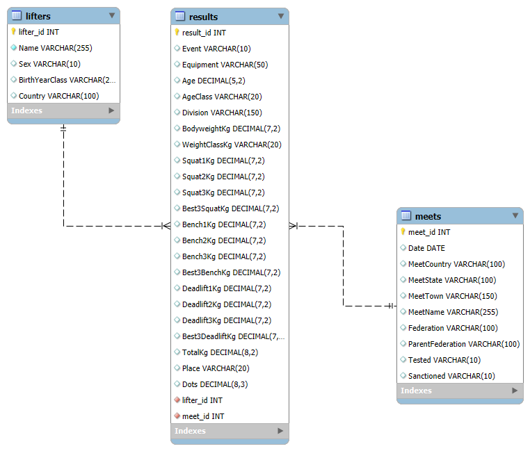

# OpenPowerlifting Relational Database

A relational database project built from OpenPowerlifting competition data, combining Python preprocessing, MySQL database design, SQL analysis, and data-quality validation. The current version uses a 100,000-row sample to demonstrate reproducible data preparation, normalized table design, joins, aggregations, common table expressions, and window functions.

## Objective

The objective of this project is to transform a large, flat powerlifting competition dataset into a structured relational database suitable for analytical querying.

The project focuses on three connected tasks:

1. Preparing raw competition data with Python.
2. Designing and loading a relational MySQL database.
3. Using SQL to analyze participation, performance, and attempt outcomes.

The database separates lifter information, meet information, and competition results into distinct tables, reducing duplication and allowing each entity to be queried independently or joined when needed.



## Data Source

The data is provided by OpenPowerlifting, an open database of powerlifting competition results from federations around the world.

The raw dataset contains athlete information, competition metadata, equipment categories, lift attempts, totals, and strength-performance metrics such as DOTS.

Raw data files are not included in this repository due to file size. To reproduce the project, download the OpenPowerlifting bulk CSV and place it in:

```
data/raw/
```

The current project pipeline processes the first 100,000 records. This sample includes:

- 100,000 competition results
- 46,407 generated lifter records
- 1,401 meets

Processed files based on the 100,000 working sample size can be found in 

```
data/processed/
```

## Methodology

### Part 1: Data Exploration

The raw dataset was initially explored in Python to inspect:

- column names and data types
- missing-value patterns
- event categories
- equipment categories
- tested and sanctioned status
- expected sparsity in lift-attempt columns

Missing attempt values were preserved because they may represent an event that did not include the lift, an attempt that was not taken, or unavailable source data.

Positive attempt values represent successful lifts, while negative values represent failed attempts.

### Part 2: Data Preparation

A Python preprocessing script:

- selects the columns required for the database
- converts dates and numeric variables
- generates primary-key identifiers
- separates the data into lifter, meet, and result tables
- validates identifier uniqueness and foreign-key coverage
- exports processed CSV files for MySQL loading

Lifter identifiers are generated from available demographic fields. Because the source data does not provide a universal athlete identifier, repeated-lifter matching is approximate.

### Part 3: Relational Database Design

The database contains three tables:

- lifters: athlete-level identifying information
- meets: competition-level metadata
- results: event participation, attempts, totals, and performance metrics

The results table contains foreign keys referencing both lifters and meets.

One lifter may have many competition results, and one meet may contain many results.

### Part 4: Data Loading and Validation

Processed CSV files are loaded into MySQL using LOAD DATA LOCAL INFILE.

Blank numeric fields are explicitly converted to SQL NULL values during loading rather than being coerced to zero.

Validation queries check:

- expected table row counts
- primary-key uniqueness
- missing foreign-key relationships
- missing-value frequencies
- valid event and equipment categories
- suspicious numeric values

### Part 5: SQL Analysis

The analytical queries demonstrate:

- INNER JOIN
- WHERE
- GROUP BY
- HAVING
- COUNT
- AVG
- conditional aggregation with CASE
- common table expressions
- window functions
- ranking within groups

Example analyses include:

- result counts by federation
- average DOTS by federation and equipment
- performance comparisons by sex
- third-attempt success rates
- summaries restricted to sanctioned meets
- top-ranked SBD performances within each equipment category

## Key Findings

| Analysis | Result |
|---|---|
| Federation participation | A small number of federations account for a large share of the 100,000 sampled results |
| Equipment comparison | Wraps, Single-ply, and Raw results show substantial differences in average totals and DOTS |
| Third squat attempts | Raw SBD lifters completed approximately 64% of recorded third squat attempts |
| Third bench attempts | Raw SBD lifters completed approximately 50% of recorded third bench attempts |
| Third deadlift attempts | Raw SBD lifters completed approximately 56% of recorded third deadlift attempts |
| Sample-size effects | Equipment categories with small result counts may show unstable or misleading averages |

These results are descriptive and reflect only the current 100,000-row sample.

## Data Quality Notes

Several data-quality issues were identified and handled explicitly:

- Fourth-attempt columns were excluded from the first database version because they are extremely sparse and generally represent special record attempts.
- Missing lift attempts were preserved as NULL rather than replaced with zero.
- Failed attempts were preserved as negative values.
- Blank numeric CSV fields were converted to SQL NULL values during import.
- Event type was retained because missing squat, bench, or deadlift values may be structurally valid for single-lift or two-lift events.
- WeightClassKg was stored as text because some classes contain values such as 90+.
- Place was stored as text because results may contain nonnumeric statuses such as disqualification.
- A carriage-return character was detected in the final CSV field and handled when filtering sanctioned meets.
- Lifter identity is approximate because names and available demographic variables do not guarantee unique athlete matching.

## Repository Structure

```
opl-relational-db/
├── data/
│   ├── raw/                       # gitignored
│   └── processed/                 # gitignored
├── docs/
│   └── schema.png
├── notebooks/
│   └── 01_data_exploration.ipynb
├── src/
│   └── prepare_data.py
├── sql/
│   ├── 01_create_database.sql
│   ├── 02_create_tables.sql
│   ├── 03_load_data.sql
│   ├── 04_data_quality_checks.sql
│   ├── 05_basic_analysis.sql
│   ├── 06_ctes.sql
│   └── 07_window_functions.sql
├── .gitignore
└── README.md
```

## Usage

1. Download the OpenPowerlifting bulk CSV.
2. Place the raw file in data/raw/.
3. Update RAW_PATH in src/prepare_data.py if necessary.
4. Run the preprocessing script:

```
python src/prepare_data.py
```

5. Open MySQL Workbench.
6. Run the SQL files in numerical order:

- 01_create_database.sql
- 02_create_tables.sql
- 03_load_data.sql
- 04_data_quality_checks.sql
- 05_basic_analysis.sql
- 06_ctes.sql
- 07_window_functions.sql

7. Update the file paths in 03_load_data.sql to match the local processed-data directory.

MySQL local file loading must be enabled for LOAD DATA LOCAL INFILE.

## Limitations

- The current version uses only the first 100,000 rows rather than the complete OpenPowerlifting dataset.
- Generated lifter identifiers may incorrectly combine different athletes with similar demographic information or split one athlete across multiple records.
- The sample is not necessarily representative of all federations, years, equipment categories, or countries.
- Descriptive comparisons do not control for sex, bodyweight, age, federation composition, or competition level unless explicitly stated.
- Small equipment or federation groups may produce unstable averages.
- Attempt-level missingness may reflect several different causes that cannot always be distinguished from the available data.

## Potential Extensions

Future development may include:

- processing the complete OpenPowerlifting dataset
- improving repeat-lifter identification
- analyzing athlete progression across meets
- adding reusable SQL views
- creating indexes and comparing query performance with EXPLAIN
- connecting MySQL directly to Power BI
- building an interactive dashboard for federation, equipment, athlete, and attempt analysis

## References

- OpenPowerlifting, bulk competition dataset and project documentation
- MySQL documentation, relational database design and SQL syntax
- OpenPowerlifting DOTS implementation and competition-data conventions
